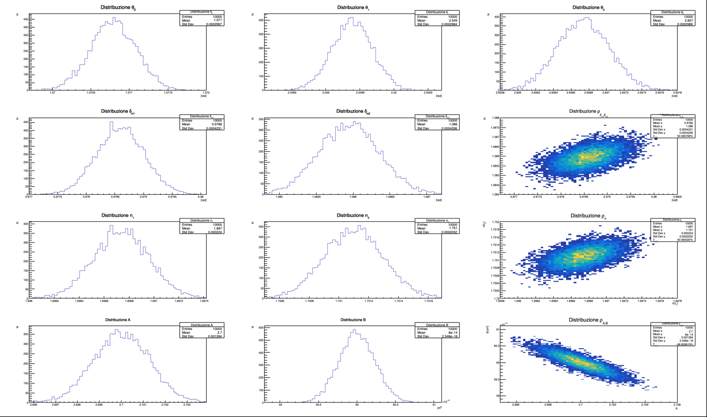

# Soluzioni esercizi del Laboratorio di Trattamento dei Dati Sperimentali - a.a. 2024/25

Questa è una repository delle mie soluzioni agli esercizi di LTNDS a Fisica in Unimi anno accademico 2024-2025.

Questa è solo una raccolta di codici esclusivamente per il confronto. Non è per la copiatura. Iterazioni future del corso potrebbero avere diversi esercizi.
Inoltre potrebbero facilmente esserci errori. Infine i professori se ne accorgono, quindi non provateci.

